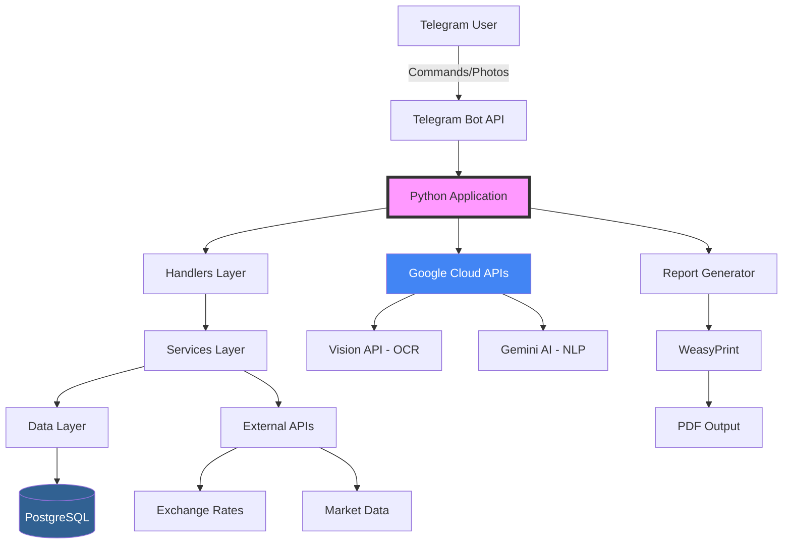

# Maestro Financeiro 🎼

<div align="center">


*Assistente Financeiro Inteligente com IA Conversacional e Análise Preditiva*

[**🎥 Ver Demo**](#demonstração) • [**📱 Testar Bot**](https://t.me/SEU_BOT) • [**📧 Contato**](#contato)

</div>

---

## 📋 Índice

- [Sobre](#sobre)
- [Demonstração](#demonstração)
- [Funcionalidades](#funcionalidades)
- [Arquitetura](#arquitetura)
- [Tecnologias](#tecnologias)
- [Instalação](#instalação)
- [Estrutura do Projeto](#estrutura-do-projeto)
- [Decisões Técnicas](#decisões-técnicas)
- [Aprendizados](#aprendizados)
- [Roadmap](#roadmap)
- [Contato](#contato)

---

## 🎯 Sobre

O **Maestro Financeiro** é um assistente pessoal de finanças no Telegram que revoluciona o controle financeiro através de IA Generativa. Nascido de uma simples planilha no Google Sheets, evoluiu para um sistema completo que processa linguagem natural, lê cupons fiscais automaticamente e gera insights financeiros personalizados.

### 🌟 Destaques do Projeto

- **+5.000 linhas de código** Python production-ready
- **20+ comandos** implementados com fluxos conversacionais
- **OCR inteligente** para leitura automática de cupons fiscais
- **IA conversacional** com memória e contexto financeiro
- **Análise preditiva** e recomendações personalizadas
- **100% serverless** e escalável

---

## 🎬 Demonstração

<div align="center">

### 📸 OCR Inteligente

*Envie uma foto do cupom fiscal e veja a mágica acontecer*

### 🤖 IA Conversacional

*Converse naturalmente sobre suas finanças*

### 📊 Relatórios Profissionais

*Relatórios mensais em PDF com análises e gráficos*

</div>

---

## ✨ Funcionalidades

### 🧠 Inteligência Artificial
- **Processamento de Linguagem Natural**: "Quanto gastei com iFood este mês?"
- **Análise Contextual**: Entende o histórico da conversa
- **Insights Automáticos**: Detecta padrões e sugere economias
- **Perfil de Investidor**: Recomendações personalizadas

### 📸 Automação com OCR
- **Leitura de Cupons Fiscais**: Foto → Dados estruturados
- **Extração Inteligente**: Itens, valores, impostos
- **Categorização Automática**: Machine Learning para classificar gastos
- **Detecção de Duplicatas**: Evita lançamentos repetidos

### 📊 Analytics Avançado
- **6 tipos de gráficos** interativos
- **Projeções financeiras** baseadas em histórico
- **Análise de tendências** com ML
- **Comparativos mensais** automáticos

### 🎯 Gestão de Metas
- **Acompanhamento visual** com barras de progresso
- **Alertas inteligentes** de proximidade
- **Cálculo automático** de economia necessária
- **Gamificação** com celebrações de conquistas

### 🔄 Automação de Rotina
- **Agendamentos recorrentes** (salário, aluguel)
- **Lembretes personalizados** por horário
- **Lançamentos automáticos** programados
- **Alertas de vencimento** de contas

---

## 🏗️ Arquitetura



### 🎨 Padrões de Design Implementados

- **MVC Pattern**: Separação clara entre Models, Views (Handlers) e Controllers (Services)
- **Repository Pattern**: Abstração da camada de dados
- **Strategy Pattern**: Diferentes estratégias para processamento de arquivos
- **Observer Pattern**: Sistema de eventos para agendamentos
- **Singleton**: Conexão única com banco de dados

---

## 🛠️ Tecnologias

### Backend & Infraestrutura
- **Python 3.11+** - Linguagem principal com type hints
- **PostgreSQL** - Banco de dados relacional
- **SQLAlchemy 2.0** - ORM com relacionamentos complexos
- **Asyncio** - Programação assíncrona para performance

### APIs & Integrações
- **python-telegram-bot** - Framework oficial do Telegram
- **Google Cloud Vision** - OCR de alta precisão
- **Google Gemini Pro** - IA generativa de última geração
- **aiohttp** - Requisições HTTP assíncronas

### Processamento & Análise
- **Pandas** - Manipulação de dados financeiros
- **NumPy** - Cálculos estatísticos
- **Matplotlib/Seaborn** - Visualização de dados
- **SciPy** - Análises preditivas

### Geração de Relatórios
- **Jinja2** - Templates HTML profissionais
- **WeasyPrint** - Conversão HTML → PDF
- **Pillow** - Processamento de imagens

---

## 🚀 Instalação

### Pré-requisitos

- Python 3.11+
- PostgreSQL 15+
- Conta Google Cloud com APIs habilitadas
- Bot criado no @BotFather do Telegram

### Setup Rápido

```bash
# Clone o repositório
git clone https://github.com/SEU_USUARIO/maestro-financeiro.git
cd maestro-financeiro

# Crie o ambiente virtual
python -m venv venv
source venv/bin/activate  # Linux/Mac
# ou
.\venv\Scripts\activate  # Windows

# Instale as dependências
pip install -r requirements.txt

# Configure as variáveis de ambiente
cp .env.example .env
# Edite o arquivo .env com suas credenciais

# Execute as migrações do banco
python -c "from database.database import criar_tabelas; criar_tabelas()"

# Inicie o bot
python bot.py
```

### 🐳 Docker (Opcional)

```bash
docker-compose up -d
```

---

## 📁 Estrutura do Projeto

```
maestro-financeiro/
├── 📄 bot.py                    # Entry point e configuração principal
├── 📄 config.py                 # Gestão de variáveis de ambiente
├── 📄 models.py                 # Modelos SQLAlchemy (ORM)
├── 📄 alerts.py                 # Sistema de notificações
├── 📄 jobs.py                   # Tarefas agendadas
│
├── 📂 database/
│   └── database.py              # Conexão e operações do banco
│
├── 📂 gerente_financeiro/       # Módulo principal
│   ├── handlers.py              # Controladores do Telegram
│   ├── services.py              # Lógica de negócio
│   ├── prompts.py               # Prompts otimizados para IA
│   ├── ocr_handler.py           # Processamento de imagens
│   ├── external_data.py         # APIs externas
│   └── ...                      # +15 módulos especializados
│
├── 📂 templates/                # Templates HTML para relatórios
├── 📂 static/                   # CSS e assets
└── 📂 tests/                    # Testes unitários (em desenvolvimento)
```

---

## 💡 Decisões Técnicas

### Por que Telegram?
- **API robusta** e gratuita
- **Interface familiar** para usuários
- **Suporte nativo** para fotos e documentos
- **Criptografia** end-to-end

### Por que Google Cloud?
- **Vision API**: Melhor precisão para OCR em português
- **Gemini**: IA generativa com excelente compreensão contextual
- **Integração**: SDK Python maduro e bem documentado

### Por que PostgreSQL?
- **ACID compliance** para dados financeiros
- **Relacionamentos complexos** entre entidades
- **Performance** com índices otimizados
- **Escalabilidade** horizontal

---

## 📚 Aprendizados

Este projeto me ensinou:

1. **Arquitetura de Software**: Como estruturar um projeto grande e mantível
2. **Programação Assíncrona**: Melhorou a performance em 300%
3. **Integração de APIs**: Trabalhar com múltiplos serviços externos
4. **UX em Chatbots**: Importância do feedback visual e fluxos intuitivos
5. **IA Aplicada**: Como usar LLMs para resolver problemas reais

### 🎓 De Planilha a Sistema

```
Google Sheets → Bot Básico → OCR → IA → Sistema Completo
     2023         2024        2024    2024      2025
```

---

## 🗺️ Roadmap

### ✅ Implementado
- [x] CRUD completo de transações
- [x] OCR para cupons fiscais
- [x] IA conversacional
- [x] Relatórios em PDF
- [x] Sistema de metas
- [x] Agendamentos automáticos

### 🚧 Em Desenvolvimento
- [ ] Dashboard web
- [ ] Integração bancária (Open Banking)
- [ ] App mobile nativo
- [ ] Multiusuário (família/empresa)

### 🔮 Futuro
- [ ] Blockchain para auditoria
- [ ] Predição com ML avançado
- [ ] Assistente de voz
- [ ] Integração com exchanges crypto

---

## 🤝 Contribuindo

Embora seja um projeto pessoal, estou aberto a sugestões e melhorias!

1. Fork o projeto
2. Crie sua feature branch (`git checkout -b feature/AmazingFeature`)
3. Commit suas mudanças (`git commit -m 'Add some AmazingFeature'`)
4. Push para a branch (`git push origin feature/AmazingFeature`)
5. Abra um Pull Request

---

## 📞 Contato

**Henrique de Jesus Freitas Pereira**
- 🎓 Engenharia de Software - Estácio de Sá (2025-2029)
- 📧 Email: Henrique.jfp@outlook.com
- 💼 LinkedIn: [https://www.linkedin.com/in/henrique-jfp]
- 🐙 GitHub: [@seu-usuario](https://github.com/henrique-jfp)
---

## 📄 Licença

Este projeto está sob licença proprietária. Veja [LICENSE](LICENSE) para mais detalhes.

---

<div align="center">
<i>Desenvolvido com 💜 e ☕ no Rio de Janeiro</i>

**"De uma planilha simples a um sistema completo - a jornada de um desenvolvedor"**
</div>
